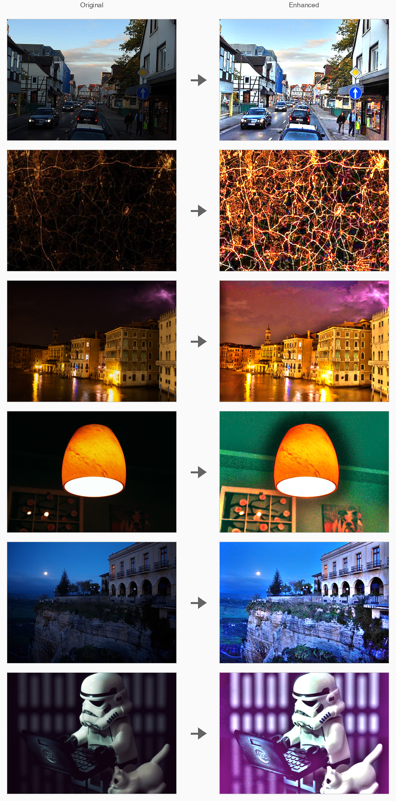
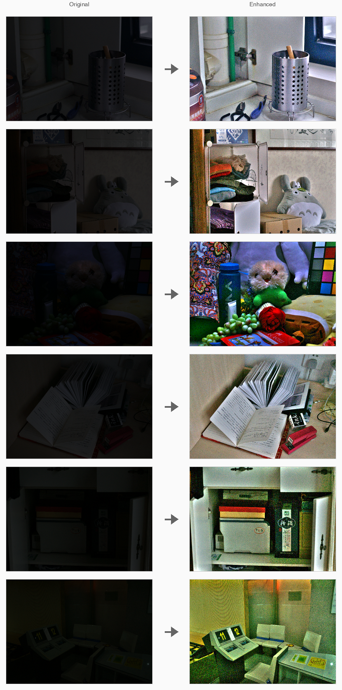

# LIME: Illumination Map Estimation

A modern, refactored and minimal implementation of the "LIME" (Low-Light Image Enhancement via Illumination Map Estimation) algorithm for improving the visibility of low-light images.

## Overview

Images taken in low-light conditions suffer from low visibility. This problem degrades the visual aesthetics of those images and damages the performance of machine vision methods that use those images. This project implements the LIME algorithm to recover hidden information buried in darker regions of captured images by estimating and refining an illumination map using the Retinex model and ADMM optimization.



## Results

### Processing Pipeline

The LIME algorithm processes images through multiple stages to achieve optimal enhancement:



## Algorithm

The LIME algorithm works in several steps:

1. **Initial Illumination Map Estimation**: Estimates an initial illumination map as the maximum intensity across RGB channels at each pixel (following the Retinex model).

2. **Illumination Map Refinement**: Refines the initial map using ADMM (Alternating Direction Method of Multipliers) optimization to solve:
   ```
   min_T ||T - L||_2^2 + alpha*||DT||_1
   ```
   where T is the refined map, L is the initial map, D is the gradient operator, and alpha controls structure preservation.

3. **Gamma Correction**: Applies gamma correction to the refined illumination map for better visual results.

4. **Image Enhancement**: Enhances the image by dividing each channel by the corrected illumination map.

## Project Structure

```
LowLightImageEnhancement/
├── matlab/                   # MATLAB implementation
│   ├── @LIME/               # LIME class directory
│   │   └── LIME.m           # Main LIME class implementation
│   ├── utils/               # Utility functions
│   │   ├── computeGradient.m
│   │   ├── applyGradientAdjoint.m
│   │   ├── computeTDenominator.m
│   │   ├── computeTNumerator.m
│   │   └── createDifferenceMatrix.m
│   ├── config.m             # Configuration function
│   ├── main.m               # Main script
│   └── batch_process.m       # Batch processing script
├── python/                  # Python implementation
│   ├── utils/               # Utility functions
│   │   ├── compute_gradient.py
│   │   ├── apply_gradient_adjoint.py
│   │   ├── compute_t_denominator.py
│   │   ├── compute_t_numerator.py
│   │   └── create_difference_matrix.py
│   ├── lime.py              # Main LIME class implementation
│   ├── config.py            # Configuration module
│   ├── main.py              # Main script
│   ├── batch_process.py     # Batch processing script
│   └── requirements.txt     # Python dependencies
├── images/                  # Input images directory
├── output/                  # Output images directory
└── README.md
```

## Usage

### MATLAB Implementation

#### Quick Start

1. **Configure parameters** by editing `matlab/config.m`:
   ```matlab
   config.inputPath = 'images/your_image.bmp';  % Input image path
   config.outputDir = '../output';               % Output directory
   config.alpha = 3;                            % Structure preservation weight
   config.gamma = 0.8;                          % Gamma correction parameter
   config.numIterations = 50;                    % ADMM iterations
   ```

2. **Run the main script**:
   ```matlab
   cd matlab
   main()
   ```

#### Using the LIME Class Directly

For more control, you can use the LIME class directly:

```matlab
% Create enhancer with custom parameters
enhancer = LIME('alpha', 3, 'gamma', 0.8, 'numIterations', 50);

% Load and enhance image
inputImage = imread('images/your_image.bmp');
[enhancedImage, results] = enhancer.enhance(inputImage);

% Display results
imshow(enhancedImage);
```

### Python Implementation

#### Quick Start

1. **Install dependencies**:
   ```bash
   pip install -r python/requirements.txt
   ```

2. **Configure parameters** by editing `python/config.py`:
   ```python
   input_path: str = 'images/your_image.bmp'  # Input image path
   output_dir: str = '../output'               # Output directory
   alpha: float = 3.0                          # Structure preservation weight
   gamma: float = 0.8                          # Gamma correction parameter
   num_iterations: int = 50                    # ADMM iterations
   ```

3. **Run the main script**:
   ```bash
   cd python
   python main.py
   ```

#### Using the LIME Class Directly

For more control, you can use the LIME class directly:

```python
from lime import LIME
from PIL import Image
import numpy as np

# Create enhancer with custom parameters
enhancer = LIME(alpha=3, gamma=0.8, num_iterations=50)

# Load and enhance image
input_image = np.array(Image.open('images/your_image.bmp'))
enhanced_image, results = enhancer.enhance(input_image)

# Display results
from matplotlib import pyplot as plt
plt.imshow(enhanced_image)
plt.show()
```

### Configuration Parameters

- `alpha` (default: 3): Weight parameter for structure preservation. Higher values preserve more structure but may over-smooth.
- `gamma` (default: 0.8): Gamma correction parameter. Values < 1 brighten the image.
- `rho` (default: 1.15): ADMM penalty parameter update rate. Controls convergence speed.
- `mu` (default: 0.05): Initial ADMM penalty parameter.
- `numIterations` (default: 50): Number of ADMM iterations. More iterations improve quality but increase computation time.

## References

[1] Xiaojie Guo, Yu Li, and Haibin Ling, "LIME: Low-Light Image Enhancement via Illumination Map Estimation," IEEE Transactions on Image Processing, vol. 26, pp. 982-993, 2017.

[2] S. Boyd, N. Parikh, E. Chu, B. Peleato, and J. Eckstein, "Distributed optimization and statistical learning via the alternating direction method of multipliers," Foundations and Trends in Machine Learning, vol. 3, no. 1, pp. 1–122, 2011. [Online]. Available: http://dx.doi.org/10.1561/2200000016

